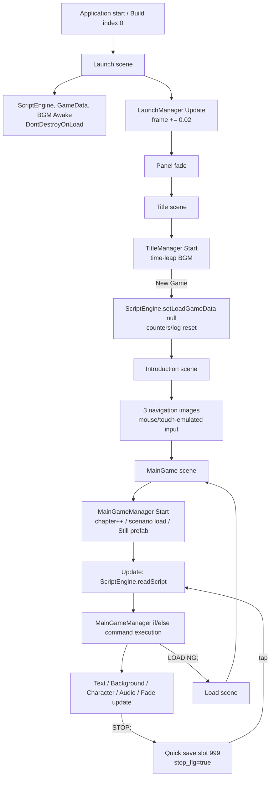
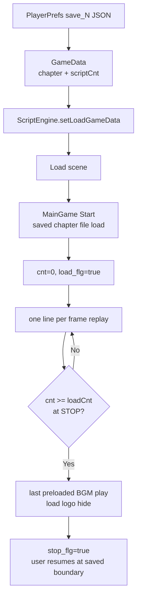
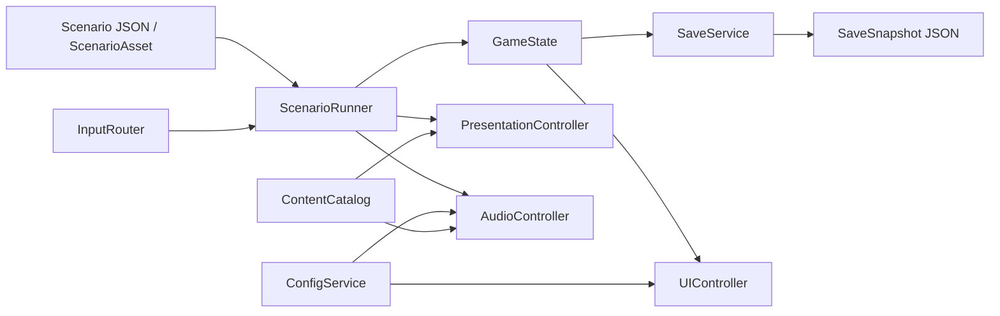

# Leap 2026 Technical Audit

調査基準日: 2026-09-16

対象: `Leap/` 以下のUnityプロジェクト（生成物である `Library/`, `Temp/`, `Logs/`, `UserSettings/` は構造調査の対象外）

この文書では、次のラベルを使う。

- **確認済み**: リポジトリ内のコード、データ、Unity設定、またはUnity 2020.2.2f1で開いた調査用コピーから確認した事実。
- **判断**: 確認済みの事実を根拠にしたLeap 2026向けの技術判断。
- **未確認**: リポジトリだけでは確定できない事項。推測で補完しない。

調査時に元リポジトリのUnityプロジェクトは開いていない。バイナリ形式のシーンとPrefabは `/tmp` に作ったコピーを、同梱バージョンと一致するUnity 2020.2.2f1のバッチモードで読み取った。調査用コードはコピー側だけに置き、元リポジトリへの変更はこの文書のみである。

## 1. Executive Summary

### 結論

**Leap 2026には Option B「新しいUnityプロジェクトを作り、必要な資産とシナリオだけを移植」を推奨する。** 2026-09-16時点では、最新LTSである **Unity 6.3 LTSの最新パッチ**を第一候補とし、開始時にXcode 26/27で実機ビルドする短い技術スパイクを行ってバージョンを固定する。Unity 6.3 LTSは2027年12月までサポートされる。[Unity公式のリリースサポート](https://unity.com/releases/unity-6/support)

旧版の価値は、データ駆動という考え方、既存シナリオ本文、背景・立ち絵・スチル・音楽・効果音資産、そして必要な演出語彙にある。一方、実装は `ScriptEngine` と `MainGameManager` に解釈・進行・表示・ロード復元が集中し、Unityオブジェクト名、フレームレート、`Resources`、複数シーンに強く結合している。既存コードをUnity 6へ持ち上げてから直すより、新規プロジェクトで小さなRunnerを作り、Chapter 01〜03だけを移植する方が、変更範囲と回帰範囲を制御しやすい。

### 主要な確認結果

- Unityは **2020.2.2f1**。シーン10個、Prefab 17個、シナリオ18章、C# 24ファイル（Editor拡張1本を含む）。`Assets` は約224 MBで、画像110枚、BGM 14曲、SE 5個を含む。
- シナリオはUTF-8の行指向テキスト。全3,585行中、本文1,469行、入力停止 `STOP;` 1,468行、立ち絵240命令、背景97命令などで構成される。
- Parser/Interpreterは独立していない。`ScriptEngine.readScript()` が1行を `:` で分割し、`MainGameManager.Update()` の `if/else` が直接Unity UIやAudioを変更する。
- セーブは `chapter` と行カウンタ `scriptCnt` しか進行状態を保持しない。ロード時は章頭から保存位置まで1フレーム1命令で再実行する。背景・立ち絵等を再現するが、復元時間は保存位置に比例し、副作用抑止も命令ごとの条件分岐に依存する。
- Config、Auto、Skip、Voice、文字サイズ変更、コントラスト変更、Safe Area対応は存在しない。Backlogは実行中メモリにある本文配列を別シーンで並べるだけである。
- UIは主に2778×1565を基準にするが、一部Canvasは1136×720を使い、ほぼ全要素が中央固定アンカーである。Player Settingsの既定解像度は1024×768、方向はLandscape Left固定である。autorotate許可flagは四方向ともtrueだが、このorientation設定では有効性を確認していない。
- 現在の全シナリオから参照される背景、立ち絵、BGM、SEは、ファイル名ベースの照合では全て存在する。Chapter 01〜03のスチル参照も各章Prefab内に存在する。
- 自動テスト、CI、ビルドスクリプト、asmdefはない。Package lockはあるが、シーンと多くのProject Settingsがバイナリで、EditorのSerialization ModeはMixedである。

### Vertical Sliceで確立すべき「型」

1. バージョン付きシナリオデータと、ビルド前に全参照を検証するValidator。
2. Unity表示から独立した `ScenarioRunner` と、明示的な待機状態を持つ進行制御。
3. 表示の正本となる `GameState` と、コマンド境界で保存する `SaveSnapshot`。
4. 背景・人物・音・フェードを担当する小さなController群。
5. Backlog / Auto / Skip / ConfigをRunnerの状態遷移として扱う一貫した入力モデル。
6. 16:9の演出面とSafe Area内の操作面を分けるレスポンシブUI。

## 2. Current Architecture

### 2.1 プロジェクトとPackage

| 項目 | 確認結果 | 根拠 |
|---|---|---|
| Unity | 2020.2.2f1 | `Leap/ProjectSettings/ProjectVersion.txt` |
| Product / Company | `Leapときをこえて` / `aohige` | `PlayerSettings`をUnityで抽出 |
| Bundle ID | iOS / Androidとも `com.aohige.leap1` | `PlayerSettings`をUnityで抽出 |
| iOS | iPhone and iPad、IL2CPP、設定上の最小OS 11.0 | `PlayerSettings`をUnityで抽出 |
| Color Space | Gamma | `PlayerSettings`をUnityで抽出 |
| Serialization | Mixed。シーン・Prefab・多くのProject Settingsはバイナリ | `EditorSettings`、`file`、Unityでの読み取り |
| Render Pipeline | Scriptable Render Pipeline資産なし。Built-in相当 | `GraphicsSettings.asset`、Package manifest |
| テスト/CI | Test Framework packageはあるがテスト、CI、asmdef、build scriptなし | 全ファイル一覧 |

`Leap/Packages/manifest.json` の直接依存は次のとおり。

| 分類 | Package / version | リポジトリ内での使用 |
|---|---|---|
| UI | `com.unity.ugui 1.0.0` | 全画面で使用 |
| Text | `com.unity.textmeshpro 3.0.1` | Packageのみ。コードとシーンはLegacy `UnityEngine.UI.Text` |
| 2D | `com.unity.2d.sprite 1.0.0`, `com.unity.2d.tilemap 1.0.0` | Spriteは使用。Tilemap使用は確認できない |
| Timeline | `com.unity.timeline 1.2.6` | 使用箇所なし |
| サービス | Ads 3.5.2, Analytics 3.5.3, Purchasing 2.2.1 | コード参照なし。必要性を確認できない |
| XR | Legacy Input Helpers 2.1.7 | 使用箇所なし |
| 開発 | Rider 2.0.7, Visual Studio 2.0.5, VS Code 1.2.3, Test Framework 1.1.20, Collab Proxy 1.3.9 | Editor向け。テスト・Collabの運用設定は見当たらない |

`Assets` 配下に `.dll`, `.aar`, `.jar`, `.framework`, `.so` や独自Pluginディレクトリはなく、外部Pluginは確認されなかった。

### 2.2 主要サブシステム

| 機能 | 担当 | 実装の要点 |
|---|---|---|
| 起動 | `LaunchManager` | フレーム加算で待機し、Panel fade後にTitleへ遷移 |
| 永続オブジェクト | `ScriptEngine`, `GameDataComponent`, `BGMComponent` | `SingletonMonoBehaviour<T>` と `DontDestroyOnLoad` |
| シナリオ読込 | `ScriptEngine.readScenarioFile()` | `StreamingAssets/Scenario/scriptNN.txt` を章ごとに全行読込 |
| 行解析 | `ScriptEngine.readScript()` | `listScript[cnt]` を取得し `Split(':')`。`STOP;` だけ特別扱い |
| 命令実行 | `MainGameManager.Update()` | 文字列比較でUI、Audio、Sceneを直接操作 |
| 本文表示 | `TextManager` | Legacy UI Textへ0.05秒間隔のSubstring表示 |
| 背景・人物 | `MainGameManager` | `Resources.Load<Sprite>()` と3固定スロットのImage |
| スチル | `ScriptEngine` + `Still-NN.prefab` + `SpriteScript` | 章Prefabを生成し、名前検索で個別Imageをshow/hide |
| BGM | `BGMComponent` | 永続AudioSource 1本。Resourcesからclipを差替え |
| SE | `MainGameManager` | MainGameシーンの`Effect` AudioSource 1本へclipを差替え |
| Fade | `SceneComponent`, `PanelComponent` | Canvas上のImage alphaを毎フレーム変更しdelegateを呼ぶ |
| 特殊Animation | `SelfAnimation` | Chapter 18の雪・背景移動をオブジェクト名で分岐 |
| 入力 | EventTrigger、`Input.GetMouseButtonDown`、2D Collider | UIイベントと物理当たり判定が混在 |
| Save / Load | `GameDataComponent`, `SaveLoadManager`, `DataBox` | PlayerPrefs JSON、手動6枠、Quick slot 999 |
| Backlog | `ScriptEngine.textLogs`, `BackLogManager` | `[話者, 本文]` をメモリ保持し、セルを全件生成 |
| Menu | `GameMenuManager` | Additive sceneとして表示しMainGameのUpdateを停止 |
| Config / Auto / Skip | 該当なし | 実装・設定データ・UIなし |

### 2.3 シーン構成とエントリーポイント

`EditorBuildSettings` の有効シーンは次の順序である。ビルドindex 0の `Launch` がエントリーポイントになる。

| index | Scene | Manager / 役割 |
|---:|---|---|
| 0 | `Launch` | `LaunchManager`。ロゴ、永続ScriptEngine/GameData/BGMを生成 |
| 1 | `Title` | `TitleManager`。New / Quick / Load / 外部URL |
| 2 | `SaveLoad` | `SaveLoadManager`。TitleまたはGameMenuからAdditive表示 |
| 3 | `MainGame` | `MainGameManager`。シナリオの実行と表示 |
| 4 | `Load` | `LoadManager`。章間・ロード時の固定時間ローディング |
| 5 | `BackLog` | `BackLogManager`。Additive表示 |
| 6 | `GameMenu` | `GameMenuManager`。Additive表示 |
| 7 | `Ending` | `EndingManager`。9枚のending Imageを順次表示 |
| 8 | `Introduction` | `IntroductionManager`。3枚の操作説明画像 |
| 9 | `EOF` | `EOFManager`。待機後のタップでTitleへ戻す |

`Launch` にある `ScriptEngine`, `GameDataComponent`, `BGM` は `DontDestroyOnLoad` される。一方、`Title` にも同名の `ScriptEngine` と `GameDataComponent` があり、`SaveLoad` にも `GameDataComponent` がある。重複側はSingletonの `Awake()` で **Componentだけ** `Destroy(this)` され、同名GameObjectは残る。このため後続の `GameObject.Find("ScriptEngine")` / `Find("GameDataComponent")` は、永続個体と空の重複GameObjectを名前だけでは区別できない。

### 2.4 UI / Canvas / 解像度

確認した主要設定:

- 主表示Canvas: 2778×1565、`Scale With Screen Size`、`Screen Match Mode = Expand`。
- Fade/Dialogの一部: 1136×720。2種類の基準解像度が同一画面で混在する。
- MainGameの`ViewCanvas`: Screen Space Camera、sorting order 110。
- Fade Canvas: sorting order 1000。GameMenu/SaveLoad/Dialogもsorting orderの直接変更で前後関係を作る。
- MainGameの背景とタップ面: 2778×1565固定。人物中央・左右、本文Window、ボタンも中央固定アンカー。
- 本文: M+ 1c、44px、Legacy UI Text、固定サイズ1362×193.8。名前欄も44px。
- Safe Areaを読むコード、Safe Area用Rect、端末別レイアウトは存在しない。
- 背景PNGの原寸は2778×1565だが、Importerの`maxTextureSize`は2048。UI SpriteにもMipMapが有効で、iOS固有overrideはない。

## 3. Runtime Flow

### 3.1 新規開始



コード上の詳細:

1. `LaunchManager.Start()` が`max=5`, `range=0.02`を設定する。`Update()`で `frame += range` するため、250フレーム後にFadeを開始する。秒ではなくフレーム依存である。
2. `Launch` の永続3コンポーネントは `Awake()` でSingleton判定と`DontDestroyOnLoad`を行う。`ScriptEngine.Start()` は名前検索でGameData/BGMを取得する。
3. `TitleManager.Start()` が `time-leap` を再生する。New Gameは `setLoadGameData()` で章・位置・ログをリセットし、Introductionへ移る。
4. IntroductionはColliderと `Input.GetMouseButtonDown(0)` で3画面を進める。最後はフレーム加算による待機と`WaitForSeconds(4)`を経てMainGameへ移る。
5. `MainGameManager.Start()` はロード中でなければ `initGameScene(0)` を呼ぶ。`currentChapter==0`なので永続 `chapter` を1増やし、`script01.txt`を読む。章替わりではLoad sceneを挟んでMainGameを再生成し、同じ処理で次章へ進む。
6. `MainGameManager.Update()` は停止条件を確認した後、毎フレーム1行だけ読む。`# MSG`の次のフレームで通常 `STOP;` に到達し、入力待ちになる。
7. 画面タップ時、タイプ表示中なら全文表示する。タイプ表示完了後のタップなら本文を消して `stop_flg=false` にし、次フレームから命令読込を再開する。
8. `LOADING;` はFade後にLoad sceneへ移動する。Load sceneも `frame += 0.02` を250フレーム行い、再びMainGameへ移る。
9. Chapter 17の`ENDING;`はEnding sceneへ移動し、9枚を順番に表示する。その後Load経由でChapter 18へ進む。Chapter 18の`EOF;`はEOF sceneへ移り、Titleへ戻る。

### 3.2 Quick / Manual Load



- Saveは `STOP;` を読んだ直後の `cnt` を記録する。Loadでは章頭から各 `STOP;` を無視して進み、保存した `cnt` 以上になった `STOP;` で止まる。
- ロード再生中はBGMの`PLAY`、BLACK/WHITE、SEだけが部分的に抑止される。背景、人物、スチル、ログ、BGMのpreload、BGM STOP、WAIT、ANIMATIONは通常経路を通る。
- 復元時間は行位置に比例する。例として298行のChapter 02末尾なら60fpsで約5秒、568行のChapter 08末尾なら約9.5秒が理論上の再実行時間になる。実時間はフレームレートに依存する。

## 4. ScriptEngine Analysis

### 4.1 構造

独立したParser、AST、Command型、Interpreterは存在しない。

1. `ScriptEngine.readScenarioFile()` が章ファイルを `List<string>` に格納する。
2. `ScriptEngine.readScript()` が現在行を取得して`cnt`を増やす。
3. 行が厳密に `STOP;` なら停止・Quick Save・Load追いつき判定を行う。
4. それ以外は `ret.Split(':')` の文字列配列を返す。
5. `MainGameManager.Update()` が `script[0]` を文字列比較し、Unityオブジェクトを直接更新する。

したがって `ScriptEngine` という名前ではあるが、実際の解釈器は `ScriptEngine` と `MainGameManager` に分散している。ゲーム状態の正本もなく、画面上のImage、AudioSource、各boolと行カウンタの組合せが状態そのものになっている。

### 4.2 状態とシナリオ位置

| 状態 | 保持場所 | 用途 |
|---|---|---|
| `chapter` | ScriptEngine | `scriptNN.txt` と `Still-NN.prefab` の選択 |
| `cnt` | ScriptEngine | 次に読む物理行index |
| `stop_flg` | ScriptEngine | `STOP;`後の入力待ち |
| `load_flg`, `loadCnt` | ScriptEngine | 章頭再実行による復元 |
| `textLogs` | ScriptEngine | Backlogの話者・本文 |
| Fade/Wait/遷移中 | MainGameManager / PanelComponent | 複数boolとfloat |
| 背景・人物・スチル | Unity UI Image | 明示的なモデルなし |
| BGM | 永続AudioSourceのclip/loop/play state | 明示的なモデルなし |
| フラグ・分岐 | 該当なし | 旧シナリオは一本道 |

シナリオ位置は意味のあるIDではなく物理行番号である。既存行の途中に命令を追加・削除すると、その後にある旧Saveの `scriptCnt` は別の位置を指す。

### 4.3 非同期、Wait、入力待ち

- Scenario Runnerとしての非同期抽象はない。通常命令はUpdateごとに1つ実行される。
- `STOP;` が本文進行の入力待ち。タップイベントが `stop_flg` を解除する。
- `# WAIT:n` は `maxWaitTime=n` とし、毎フレーム `waitTime += 0.03` する。`n`は実際の秒数ではない。60fpsなら `WAIT:2` は約1.1秒、`WAIT:5` は約2.8秒になる。
- FadeもImage alphaへ固定値を毎フレーム加算する。端末の60/120Hz、フレーム落ちで実時間が変わる。
- Androidのシナリオ読込はobsoleteな `WWW` Coroutineを開始するだけで、MainGame側は完了を待たない。次のUpdateで空の`listScript[0]`へアクセスできる競合がある。iOS/Editorは同期File IOである。
- File IO例外はcatch後に何も記録しない。欠損ファイルと空ファイルを区別できず、その後のindexアクセスで別の例外になり得る。

### 4.4 命令追加の難易度と結合度

表面的には `else if` を1つ追加すればよい。しかし実際には、次を同時に判断する必要がある。

- 通常再生時のUnity操作。
- Load高速再生時に実行するか、抑止するか。
- Wait/Fade/Inputとの相互排他。
- Skip/Auto（現在未実装）での所要時間とキャンセル方法。
- SaveSnapshotへ含めるべき状態。
- Backlogへ残すか。

命令データは `Resources` のパス、Scene内GameObject名、タグ、Imageの配置を直接知っている。たとえば `# IMG` は `Sprite/character/`、`# BG` は `Sprite/Background/` に固定され、`# STILL-IMG` は `GameObject.Find(script[1])` で探す。シナリオとUnityコードの結合度は高い。

### 4.5 Skip / Auto / Saveとの関係

- Auto / Skipは実装されていない。
- 現行構造へ後付けする場合、`STOP;`解除だけでなくTextAnimation、Fade、WAIT、特殊Animation、未読判定、Additive Menu中の停止を個別に調整する必要がある。
- Saveは表示状態を持たず、Load replayに依存する。命令を追加するたびに「ロード中の副作用」を条件分岐で管理するため、命令数に比例して復元不具合の余地が増える。

### 4.6 再利用評価（A/B/C）

| 評価 | 対象 | 理由 |
|---|---|---|
| **A: ほぼそのまま再利用** | シナリオ本文、章分割、背景/BGM/SE/人物の既存ID、基本演出語彙 | データ駆動のコンテンツとして価値があり、参照資産も現存する |
| **B: 考え方を再利用し実装を作り直す** | `ScriptEngine`全体、順次Command実行、入力待ち、Backlog、章遷移 | 責務は必要だが、型・状態・非同期・エラー処理・snapshot境界を明示する必要がある |
| **B** | 現行Scenario format | 1行1命令は編集しやすいが、`:`分割、物理行Save、schema/version/ID/validatorなしは維持できない |
| **C: 2026版では捨てる** | Update内の巨大if/else、章頭高速再生、`stop_flg/load_flg`制御、固定フレーム加算、名前検索、platform別直接File IO | 新要件を足すほど組合せが増え、snapshot方式と両立しない |

**総合評価: ScriptEngineはB。思想とコンテンツは残し、実装はREBUILDする。**

## 5. Scenario Data Format

### 5.1 形式と文法

- 配置: `Leap/Assets/StreamingAssets/Scenario/script01.txt` 〜 `script18.txt`
- Encoding: BOMなしUTF-8、LF改行。
- 1行1命令。コメント、空行、escape、version header、label、分岐はない。
- 一般形は `COMMAND:arg1:arg2...`。ただし `STOP;`, `LOADING;`, `ENDING;`, `EOF;` は単独token。
- Parserは `string.Split(':')` なので、本文や話者名に `:` を含められない。現データの `# MSG` には追加のcolonはなく、現時点では偶然衝突していない。
- `# MSG`の次に原則 `STOP;` を置くことで、1メッセージ単位の入力待ちを表現する。

### 5.2 命令一覧（全18章の実使用）

| 命令 | 構文 | 件数 | 実装・意味 | 問題 |
|---|---|---:|---|---|
| Message | `# MSG:text[:speaker]` | 1,469 | 本文と任意話者をTextへ設定しLog追加 | colon不可、改行/ruby等なし |
| Stop | `STOP;` | 1,468 | 入力待ち、Quick Save | 物理行Saveと結合 |
| Character | `# IMG:asset:slot` | 240 | `center/right/left`のImageへSprite設定 | 現データはcenterのみ。path文字列直結 |
| Background | `# BG:asset` | 97 | 背景ImageへSprite設定 | transition指定なし |
| BGM | `# BGM:asset:PLAY/STOP/REFRESH` | 74 | PLAY 35、STOP 35。REFRESH 4は実装なし | REFRESHは無言で無視される |
| Still | `# STILL-IMG:name:show[:fadeFlag]` / `hide` | 70 | 40 show、30 hide | showだけ第4引数必須、名前検索 |
| Black fade | `# BLACK:0.03` | 70 | 人物/UIを消し黒Fade | 全件0.03。フレーム依存 |
| White fade | `# WHITE:0.03` | 13 | 同上、白Fade | 全件0.03。フレーム依存 |
| Remove | `# REMOVE-IMG:bg/center` | 48 | Spriteをnull化 | right/leftはコード上可能だが未使用 |
| SE | `# EFFECT:asset` | 10 | Effect AudioSourceで1回再生 | overlap、category volume、完了待ちなし |
| Wait | `# WAIT:n` | 5 | UIを隠して固定フレーム待機 | `n`秒ではない、Skip/Load考慮なし |
| Animation | `# ANIMATION:name:run` | 2 | Chapter 18のSelfAnimationを開始 | 特定GameObjectとコード分岐に直結 |
| Chapter next | `LOADING;` | 16 | FadeしてLoad sceneへ | 次章番号は暗黙の`chapter++` |
| Ending | `ENDING;` | 1 | Ending sceneへ | 専用Scene/Managerに直結 |
| EOF | `EOF;` | 1 | EOF sceneへ | 専用Scene/Managerに直結 |

データ上の既知の不整合:

- `script08.txt:146` は `STOP` でsemicolonがない。実装は厳密な `STOP;` だけを認識するため、この箇所は入力待ちにならず無言で通過する。
- `# BGM:...:REFRESH` が4件あるが、`MainGameManager`はPLAY/STOPしか実装していない。各REFRESH直後にPLAYがあるため結果的に次のPLAYで読み直されるが、REFRESH行自体はno-opである。
- 未知命令、引数不足、数値parse失敗、存在しないassetを検出するvalidatorがない。未知命令は無言で無視される場合があり、引数不足やasset欠損は実行時例外になり得る。

### 5.3 Chapter 01〜03

| ファイル | 行数 | 本文数 | 主な内容/演出 | 主な資産 |
|---|---:|---:|---|---|
| `script01.txt` | 182 | 76 | 高台、歩との再会、祭へ移動 | 高台背景、歩3表情、BGM 2、Still-01 |
| `script02.txt` | 298 | 126 | 夏祭り・射的 | 祭/射的背景、歩6表情、BGM 2、SE、Still-02 |
| `script03.txt` | 176 | 71 | 休憩、花火へ移動、はぐれる、後悔 | 3背景、歩6表情、BGM 2、Still-03 |

合計656行、本文273件、概算21,196文字であり、依頼にあるVertical Sliceの範囲と内容は一致して見える。ただし、**「Chapter 01〜03相当」が現行 `script01`〜`03`をそのまま指すかは制作判断なので未確認**である。

### 5.4 2026形式の提案

既存本文は変換元として保持し、実行形式はversion付きJSONにする。Vertical Sliceでは新しい外部DSLや会話ミドルウェアを導入せず、1章1ファイルの単純なDTOで十分である。

```json
{
  "schemaVersion": 1,
  "chapterId": "ch01",
  "commands": [
    { "id": "ch01-0010", "type": "playBgm", "assetId": "bell-leap", "loop": true },
    { "id": "ch01-0020", "type": "setBackground", "assetId": "upland_evening" },
    { "id": "ch01-0030", "type": "say", "speaker": null, "text": "僕は、高台から見える景色を眺めていた。" }
  ]
}
```

要点:

- `id` は保存位置に使う安定ID。表示順とIDを分離し、途中に命令を足しても既存Saveを壊しにくくする。
- `type` は閉じた一覧とし、未知値をimport/build時にerrorにする。
- Asset IDは `ContentCatalog` でSprite/AudioClip参照へ解決し、全章をEditor validatorで検査する。
- JSONは人手ではやや冗長だが、標準構文、明示的なfield、差分、Codexによる変換・検証との相性がよい。現段階でYAMLや独自quote parserを増やす利点は小さい。
- 実行前にDTOを型付き `ScenarioAsset` へimportするか、起動時に一度だけparseする。Vertical Sliceではどちらか一方に固定し、二重のauthoring formatは持たない。

## 6. Save / Load Architecture

### 6.1 現行Save

`GameData` のpublic field:

```text
chapter, scriptCnt, abridgeText, saveDate, binaryCapture
```

- `JsonUtility.ToJson()` でJSON化し、`PlayerPrefs` の `save_1`〜`save_6`へ保存する。
- `save_999` は各 `STOP;` で更新するQuick Save。
- 手動Save用プレビューは `Screen.width × Screen.height` のスクリーンショットをPNG化し、Base64文字列としてJSON内部へ入れる。
- Save Menuを開く直前にスクリーンショットと現在本文を `activeData` へ設定する。
- 調査用Unity実行で `GameData` のJSON round-trip自体は成功することを確認した。

### 6.2 問題

1. **Snapshotではない。** 背景、人物、スチル、BGM、Fade、flagsを保持せず、章頭再実行に依存する。
2. **位置が不安定。** `scriptCnt` は物理行indexなので、シナリオ修正でずれる。
3. **schema/version/migrationがない。** 古いSaveか壊れたSaveかを判定できない。
4. **整合性検証がない。** chapter/cntの範囲外、欠損field、不正Base64で実行時例外になり得る。
5. **PlayerPrefsへ大きな画像を格納する。** Base64でPNGより約33%増え、最大7枠分を設定ストアへ置く。Quick Saveも一度画像を持つと各本文停止で巨大JSONを書き直す。
6. **Texture lifetimeが管理されない。** キャプチャ用Texture2D、DataBox用Texture2D/Spriteを明示破棄しない。Save画面を繰り返すとnative memoryの増加要因になる。
7. **サムネイル処理が重い。** `TextureScale` は各画像をColor配列化してthreadを起動し、main threadを`Thread.Sleep(1)` loopで待たせる。6枠表示時にメモリとCPUのspikeを作る。
8. **atomic write/backupがない。** `PlayerPrefs.SetString`だけで、slot破損時の予備データもない。

### 6.3 Leap 2026 Snapshot

Saveはユーザーが入力待ちになった**完了Command境界だけ**で許可する。途中のFadeや文字送りのfractionまで保存しないことで、形式を小さく安定させる。

```text
SaveSnapshot
├─ schemaVersion / contentVersion / savedAt
├─ slotId / previewText / thumbnailFile
├─ chapterId / nextCommandId
├─ GameState
│  ├─ backgroundId
│  ├─ characterSlots { left, center, right }
│  ├─ visibleStillIds
│  ├─ presentationMode / overlayColor
│  ├─ bgm { assetId, loop, playbackSeconds? }
│  └─ flags
└─ recentBacklog[]
```

実装方針:

- Save本体は `Application.persistentDataPath` のversion付きJSON。`PlayerPrefs` は小さなConfigだけに限定する。
- `slot.tmp`へ書いてflush後に置換し、直前の `slot.bak` を1世代残す。
- サムネイルは小さいPNG/JPEGを別ファイルにし、Save JSONへBase64埋込みしない。
- Loadは `GameState` を `PresentationController.ApplyInstant()` と `AudioController.Restore()` へ渡し、`ScenarioRunner`を `nextCommandId` に置く。章頭から命令を再実行しない。
- BGMの厳密な再生秒復元はVertical Sliceで要否を決める。まず曲ID・loop・再生/停止の復元を必須とし、再生位置は端末差の検証後に採否を決める。
- 旧Save互換が必要なら、旧JSONを一度だけ読み、旧シナリオをtool側で該当位置まで評価して新Snapshotへ変換する。ランタイムの旧式高速再生は残さない。

## 7. UI / Audio / Presentation Architecture

### 7.1 現行UIと入力

- MainGameは背景、人物3Image、本文Window、NameTag、Text、画面全面のtap Image、Menu/Log/Fullボタンを1 Canvasに持つ。
- Title/MainGame/Menu/Save/Backlogの操作は主に `EventTrigger(PointerClick)`。`Button` componentではない。
- IntroductionとBacklog戻る処理には、Screen pointをCamera world座標へ変換し `Physics2D.OverlapPoint` でColliderを調べる旧方式も残る。
- EventSystemは `StandaloneInputModule`。Unityのmouse-to-touch互換挙動に依存する。
- Additive sceneごとにEventSystemやCanvasがあり、sorting orderを0/100/110/1000へ直接変更してmodal順序を管理する。
- 文字サイズ、速度、コントラスト、キーボード/アクセシビリティフォーカス、Safe Areaはない。

### 7.2 現行Audio

- BGM: `Launch`から永続化するAudioSource 1本、初期volume 0.7。
- SE: MainGame sceneのAudioSource 1本、volume 1.0。
- AudioMixer、BGM/SE/Voice group、fade、ducking、同時SE poolはない。
- Voice assetと再生コードはない。
- BGM/SEのImporterは `Decompress On Load`相当（`loadType: 0`）、quality 1、preload有効、iOS overrideなし。長いBGMを順番に`Resources.Load`し、明示releaseや`Resources.UnloadUnusedAssets`を行わないため、章を跨いだmemory footprintは実機profilingが必要。

### 7.3 2026方針

#### UI

- uGUI + TextMeshProを推奨する。既存がSprite中心で、小規模なサウンドノベルではuGUIの方が移植と端末検証が単純である。
- 基準解像度は1920×1080（16:9）に統一し、`Match Width Or Height`の値は端末matrixで決める。
- 背景/スチルはfull bleed領域でaspect fillし、端がcropされ得る。本文・操作ボタン・Dialogは `SafeAreaRoot` の内側に置く。
- iPadの4:3付近では、背景を広く見せるかletterboxにするかを作品演出として決める。UI都合で暗黙にstretchしない。
- 本文はTMP font assetと日本語fallbackを用意し、文字サイズ段階、行間、ウィンドウ高さをセットで定義する。既存M+フォントはライセンスファイルが同梱されているが、2026版での採用と配布条件は再確認する。
- コントラストは少なくとも通常/高コントラストのTheme tokenで、本文色、背景mask、button focusをまとめて切り替える。

#### Audio

- `AudioMixer` にMaster / BGM / SE / Voice groupを作り、Configの0〜1値をdBへ変換する。
- `AudioController` は現在BGM IDとloop状態を `GameState` へ反映し、切替、停止、必要ならcrossfadeを担当する。
- Voice未収録でもgroupと設定fieldは最初から予約し、UIを非表示にするか無効表示にする方針を決める。
- BGMはStreamingまたはCompressed In Memory、SEはDecompress On Loadを候補にし、実機memory/latencyでimport presetを固定する。

#### Asset load

- Vertical SliceではAddressablesを必須にしない。3章のローカルassetだけなら、`ContentCatalog` ScriptableObjectのID→直接参照で十分で、依存を増やさずbuild時検証できる。
- 全編化、章別download、remote content、memory group単位のload/unloadが必要になった時点でAddressablesへ移す。最初から全てをAddressables化すると、catalog/versioning/remote build運用がVertical Sliceのリスクになる。

## 8. Technical Debt & Risks

優先度はVertical SliceとiOS公開への影響で付けた。

| 優先度 | リポジトリ固有の箇所 | なぜ問題になるか | 2026での扱い |
|---|---|---|---|
| Critical | Unity 2020.2.2f1と2020年代前半のPackage | 2026年のXcode/SDKへ追随できず、旧Ads/Analytics/IAPも保守対象外。直接upgradeは10個のbinary sceneと旧APIを一度に変える | 新規Unity 6.3 LTS projectでiOS build spike |
| Critical | `ScriptEngine.readScript()` + `MainGameManager.Update()` | parse、進行、表示、Audio、Sceneが文字列分岐に集中。新命令がSave/Load/Skip/Autoへ波及 | 型付きCommandとRunnerへREBUILD |
| Critical | chapter + physical lineによるLoad replay | Save後のシナリオ編集で位置がずれ、ロード時間と副作用が保存位置依存 | stable command ID + snapshot |
| Critical | Safe Areaなし、固定中央anchor、2基準解像度混在 | iPhoneのsensor housing/home indicator、iPad aspectで本文/操作が欠けるか余白・stretchが不定 | full bleedとSafeArea UIを分離 |
| High | 固定値のframe加算 (`0.008`, `0.01`, `0.02`, `0.03`) | 60Hz/120Hzや処理落ちでFade、Wait、Load、Ending時間が変わる | `unscaledDeltaTime`ベースの一元clock |
| High | `GameObject.Find`, tag検索、文字列Scene名 | renameで実行時破損。同名永続/重複GameObjectが既に存在 | Inspector参照/constructor注入、Sceneを減らす |
| High | Singleton重複を `Destroy(this)` | Title/SaveLoadに同名のshell GameObjectが残り、Findの結果が不定になり得る | Bootstrapで一度だけ生成 |
| High | Android `WWW`読込を待たない | list完成前に`readScript`できる。`WWW`は現代Unityでlegacy API | platform共通loader、完了/失敗を明示 |
| High | Save screenshotをPlayerPrefs JSONへBase64格納 | slot容量、書込頻度、memory spike、破損復旧の問題 | file snapshot + separate thumbnail |
| High | 例外握り潰し、validatorなし | シナリオ/asset欠損の原因がログに残らず、実機でindex/null例外になる | import/buildを失敗させるvalidator |
| High | TextManagerが毎Update `StartCoroutine`、Substring | coroutineは実質同期で毎frame生成し、UTF-16 code unit単位のため結合文字/emojiを途中分割できる | TMPの型送りservice、grapheme対応方針 |
| Medium | 全contentを `Resources` 配下から文字列load | compile-time参照検証がなく、lifetimeも不明瞭。全編ではcatalog肥大とmemory管理が難しい | typed ContentCatalog、必要時Addressables |
| Medium | UI SpriteでMipMap有効、max 2048、iOS overrideなし | 2778幅の原画が2048へ縮小され、UI用MipMapの余分なmemoryを使う。端末別品質を設計していない | asset種別ごとのimport preset |
| Medium | BGMもDecompress On Load、明示releaseなし | 長尺AudioClipの展開memoryが章を跨いで残る可能性 | BGM用Streaming presetとprofile |
| Medium | Additive Menu/Backlog/SaveごとのCanvas/EventSystem | pause、sorting、modal、戻る処理がsceneとboolに分散 | 1 Game scene内のoverlay navigation |
| Medium | `TextureScale` のstatic配列/thread/main-thread待機 | Save一覧表示で大きなColor配列を作り、worker完了までmain threadをsleep pollする | 作成時に小thumbnailへencodeし表示時resizeを廃止 |
| Medium | Legacy UI Text、固定font size | 文字サイズ変更・fallback・アクセシビリティ要求へ対応しにくい | TMP + Theme/Typography settings |
| Medium | AudioSource 2本だけ、Mixerなし | 個別音量、Voice、crossfade、同時SEを一貫して制御できない | AudioMixer + AudioController |
| Medium | Serialization Mode Mixed / binary scenes | Git diffでInspector変更をreviewできず、merge/Codex編集が困難 | 新規projectをForce Textに固定 |
| Medium | asmdef/test/CI/build scriptなし | core logicとUnity UIを分離検証できず、App Store用buildの再現性がない | Core/EditMode test、scenario validator、CI build check |
| Low | 未使用Package、unused imports/dead method、複数SceneComponent | project surfaceと警告を増やし、意図を読みにくくする | 新規projectへ持ち込まない |

### iOS / App Store上の現在条件

Appleは2026-04-28以降、App Store ConnectへのuploadにXcode 26以降とiOS 26 SDK以降を要求している。[Apple Upcoming Requirements](https://developer.apple.com/news/upcoming-requirements/?id=04282026a) 2026-09時点ではXcode 27 / iOS 27 SDKによるuploadも受け付けられ、2027-04からiOS 27 SDKが最低条件になる予定である。[App Store submission](https://developer.apple.com/app-store/submitting/) したがって、Unity 2020を公開基盤として延命する判断は取れない。

現ProjectのiOS minimumは11.0だが、Xcode 26.6のdocumented deployment target範囲はiOS 15以降である。[Xcode system requirements](https://developer.apple.com/xcode/system-requirements) Leap 2026のminimum OSはiOS 15以上を初期候補とし、対象ユーザーとUnity 6.3実機結果で確定する。

## 9. KEEP / REFACTOR / REBUILD / REMOVE

分類は「旧Project内で削除作業を行う」という意味ではなく、Leap 2026へどう移すかを示す。

| 対象 | 分類 | 方針 |
|---|---|---|
| データ駆動の思想 | **KEEP** | Scenarioを表示engineが順次解釈する軸を維持 |
| Chapter 01〜03本文 | **KEEP** | version付き新形式へ機械変換し、演出意図を照合 |
| 全18章の本文/asset ID | **KEEP** | 将来移植用source of truthとして保全 |
| 背景/立ち絵/スチル/BGM/SE素材 | **KEEP** | 権利・原本・品質確認後、import設定だけ再作成 |
| M+ font | **REFACTOR** | license確認、TMP font asset/fallbackを再生成 |
| Scenario format | **REFACTOR** | 1章1ファイル・1命令単位を残し、JSON schema/stable ID/validatorへ変更 |
| ScriptEngine | **REBUILD** | ScenarioRunner、typed commands、GameStateへ分割 |
| MainGameManager | **REBUILD** | 進行と表示を分離し、巨大Update分岐を廃止 |
| Save / Load | **REBUILD** | file snapshot、atomic write、別thumbnail、migration |
| UI | **REBUILD** | 16:9 + Safe Area + TMP + responsive overlay |
| Audio runtime | **REBUILD** | Mixer group、category volume、状態同期 |
| Background表示 | **REFACTOR** | 素材/IDを残しPresentationControllerで表示 |
| Character表示 | **REFACTOR** | 素材/slot概念を残し、typed slot + transitionへ |
| Still表示 | **REFACTOR** | 素材を残し、章Prefab/GameObject.Find依存を除去 |
| Fade / Wait | **REBUILD** | time-based、cancel/complete可能な共通演出 |
| Input | **REBUILD** | UI pointer/buttonをInputRouterへ統一 |
| Scene管理 | **REBUILD** | Bootstrap + Gameを基本にし、overlayをUI state化 |
| Config | **REBUILD** | 現行不在。version付きConfigを新設 |
| Backlog / Log | **REBUILD** | structured entry、virtualized list、snapshot連携 |
| Auto | **REBUILD** | 現行不在。Runnerのadvance policyとして新設 |
| Skip | **REBUILD** | 現行不在。read historyと演出即時完了をRunnerへ統合 |
| `BGMComponent` / `PanelComponent` / `SceneComponent` | **REMOVE** | 新Controllerに置換後、旧classは持ち込まない |
| `TextureScale` | **REMOVE** | thumbnail作成時縮小へ置換 |
| `IntroductionManager`, `EndingManager`, `EOFManager` | **REMOVE** | tutorial/endingもScenario/UI flowで表現。専用Updateを持ち込まない |
| 旧Ads/Analytics/IAP/XR/Timeline/Collab packages | **REMOVE** | 利用要件が出るまで新規Projectへ追加しない |

## 10. Migration Options

### 比較

| 比較軸 | Option A: 現Projectをupgrade | Option B: 新Unityへ必要部分を移植 | Option C: Godot 4系 + GDScript |
|---|---|---|---|
| 初期開発コスト | 低く見える | 中 | 高 |
| 完成までの総コスト | 旧実装修正が重なり中〜高 | **中、範囲を3章に限定可能** | 高、runtime/tool/UIを全て再構築 |
| 移行リスク | **高**。Unity 5.4由来asset、binary scene、旧Packageを一括変換 | **低〜中**。資産単位で採否と検証が可能 | 高。engine差とiOS workflowを同時に学ぶ |
| iOS / App Store | 旧設定を引き継ぐがmodern Xcode対応が難しい | **Unity 6.3 + current Xcodeを最初に検証可能** | 公式iOS exportはあるが別pipeline |
| サウンドノベル適性 | 機能上は十分 | **十分。必要な2D/UIだけ使える** | 十分。2D/UIとtext sceneは相性がよい |
| シナリオ編集性 | 現DSLを残すと脆弱 | **schema/validatorを小さく作れる** | 同様に作れるがconverterも別実装 |
| AI/Codex保守性 | binary scene、global state、巨大Managerで低い | **Force Text、plain C#、小class、JSONで高い** | text-based scene/GDScriptで高い |
| 旧Save互換 | 最も取りやすいが現方式を残す危険 | one-time converterで必要分だけ対応 | NSUserDefaults/format bridgeが別途必要 |
| UI | 固定UIを直す範囲が広い | **Safe Area前提で最小画面を作れる** | 新規実装。柔軟だが既存知識を再利用しにくい |
| Animation / 演出 | 旧frame依存を全修正 | **必要な演出だけtime-basedで実装** | 十分だが全移植 |
| Audio | 旧AudioSourceを修正 | **AudioMixerで単純に再構成** | Audio busで再構成可能 |
| 将来拡張 | 旧Scene/Resources依存が足かせ | **Catalog/Addressablesへ段階拡張可能** | 技術的には可能、team/toolchain変更が前提 |
| 長期保守 | upgrade差分と旧債務が残る | **最新LTSと最小Packageに固定可能** | engine自体はopen sourceだがiOS export知見が必要 |

### Option Cの現実的候補

Unity以外ではGodot 4系が現実的である。公式にiOS exportとXcode project生成をサポートするが、C#のiOS exportは公式document上experimentalであるため、採用するならGDScriptが安全側となる。[Godot公式 iOS export](https://docs.godotengine.org/en/stable/tutorials/export/exporting_for_ios.html)

旧コードは小さいのでengine移行自体は不可能ではない。しかし今回の価値ある資産はUnity向けSprite/Prefab構成とC#であり、最優先は15〜20分のiOS Vertical Sliceを低riskで完成させることである。Godotへ移る明確な理由（Unity license回避、既存Godot経験、将来のopen-source要件）がない限り、engine変更まで同時に行う利益は小さい。

### 推奨

**Option B / Unity 6.3 LTSを推奨する。**

- 新規Projectにすることで、旧Projectを動く参照実装として凍結できる。
- Chapter 01〜03に必要なassetと命令だけを持ち込み、各移植stepを比較できる。
- iOS 26/27 SDK、Safe Area、modern font、AudioMixer、snapshotを最初から前提にできる。
- Unity 6のiOS buildはUnityからXcode projectを生成してXcodeでbuildする。必要moduleとXcodeの準備は公式手順に従う。[Unity公式 iOS environment setup](https://docs.unity3d.com/6000.0/Documentation/Manual/ios-environment-setup.html)

## 11. Recommended Architecture for Leap 2026

### 原則

1. **GameStateを正本にする。** UIを読んでSaveを作らない。
2. **ScenarioはUnity APIを呼ばない。** RunnerがCommandを解釈し、Controller interfaceへ依頼する。
3. **待機理由を1つの状態として表す。** `WaitingForAdvance`, `WaitingForTime`, `Transitioning`, `Paused`をboolの組合せにしない。
4. **Command完了境界をSave境界にする。** mid-animation snapshotを扱わない。
5. **IDを検証する。** asset、chapter、commandのmissing/duplicateをEditorとCIでerrorにする。
6. **依存を増やす前に必要性を示す。** Vertical SliceではDI framework、UniTask、Addressables、会話middlewareを必須にしない。

### モジュール



| 要素 | 責務 | Unity依存 |
|---|---|---|
| `ScenarioDocument` / `ScenarioCommand` | parse済み章データ、stable ID、command payload | なし、またはimport後ScriptableObjectのみ |
| `ScenarioRunner` | 次Command、待機状態、advance/auto/skip、handler呼出 | Coroutine host程度 |
| `GameState` | 背景、人物slot、still、BGM、flags、現在位置 | なし |
| `PresentationController` | UI Image/TMP/Fadeへ反映、即時復元 | あり |
| `AudioController` | BGM/SE/Voice、Mixer、state同期 | あり |
| `SaveService` | snapshot validation、atomic IO、migration | path部分のみUnity依存 |
| `BacklogService` | structured log、上限、Save連携 | なし |
| `ConfigService` | text/contrast/volume/auto/skip policy | 保存pathのみUnity依存 |
| `InputRouter` | advance、cancel、menu、backlogのrequest | あり |
| `UIController` | Title/Game/Menu/Save/Backlog/Config overlay | あり |
| `ContentCatalog` | asset IDからSprite/AudioClip等への型付き参照 | ScriptableObject |

Command handlerは `Dictionary<CommandType, handler>` のように一箇所で登録する。各handlerをGameObjectにしない。Vertical Sliceで必要なcommandは `Say`, `SetBackground`, `SetCharacter`, `ClearCharacter`, `ShowStill`, `HideStill`, `PlayBgm`, `StopBgm`, `PlaySe`, `Fade`, `Wait`, `SetFlag`, `GoToChapter`, `End` 程度で足りる。

非同期はScenarioRunnerが所有するCoroutineで統一できる。各演出は次の操作を持つ。

- 通常完了。
- `CompleteImmediately()`：Skip/Load apply時に最終状態へ置く。
- `Cancel()`：Menu、scene終了、別snapshot load時に中止する。

## 12. Vertical Slice Architecture

### 12.1 最小Scene

| Scene | 内容 |
|---|---|
| `Bootstrap` | Service生成、Config/Save metadata load、Game sceneへ移動 |
| `Game` | Title、Novel view、Menu、Backlog、Save/Load、ConfigをUI state/overlayとして保持 |

EndingやIntroductionがSliceに必要ならScenario commandまたはGame内overlayとして作る。10個のSceneとAdditive modalは再現しない。

### 12.2 Game scene hierarchy案

```text
GameRoot
├─ Presentation
│  ├─ FullBleedBackground
│  ├─ StillLayer
│  ├─ CharacterLayer (Left / Center / Right)
│  └─ FadeOverlay
├─ SafeAreaRoot
│  ├─ MessageWindow (Speaker / Body / ContinueIndicator)
│  ├─ HUD (Backlog / Auto / Skip / Menu)
│  └─ OverlayHost (Menu / SaveLoad / Backlog / Config / Dialog)
├─ Audio
└─ EventSystem
```

### 12.3 Auto / Skip / Backlogの最小仕様

- **Backlog**: `Say`完了時に `{commandId, speaker, text}` を追加。ScrollViewは全セル即時生成ではなく再利用または十分小さな上限を設定する。Load後も必要ならSnapshotへ直近件数を含める。
- **Auto**: 本文タイプ完了後、文字数に応じたdelay + Config値でadvanceする。ユーザーtap、Menu、Backlog、Skip開始で解除する。
- **Skip**: `readHistory`に含まれる `Say.commandId` のみを既定で高速化する。演出は最終状態へ即時完了し、音声待ちのpolicyを決める。未読Skip許可はConfigで明示する。
- **文字表示**: `Time.unscaledDeltaTime`を使い、文字サイズと表示速度を別設定にする。日本語のgrapheme単位を崩さない。

### 12.4 Config最小項目

```text
schemaVersion
textSize: Small / Medium / Large
textSpeed
contrastTheme: Normal / High
masterVolume / bgmVolume / seVolume / voiceVolume
autoDelay
skipUnread
```

設定は即時previewし、version付きの小さなJSONまたはPlayerPrefsへ保存する。Save slotとは分離する。

### 12.5 Vertical Sliceの完了条件

- Chapter 01〜03が冒頭から後悔まで連続再生できる。
- 全Command/asset reference validatorがpassする。
- 任意の入力待ち地点でSaveし、章頭再実行なしに同じ背景・人物・still・BGM・flagsへLoadできる。
- Backlog / Auto / Skip / text size / contrast / BGM-SE-Voice volumeが一つの端末buildで動く。
- iPhoneのcutout/home indicator、iPad aspectで操作UIがSafe Area内にある。
- 60Hz/120HzでWait/Fadeの実時間が一致する。
- current XcodeでDevelopment buildとArchiveが成功する。
- application pause/terminate後にQuick Saveまたは最後の明示Saveを安全に読める。

## 13. Proposed Migration Steps

1. **Baselineを凍結する。** 旧版をUnity 2020で起動できる環境、Chapter 01〜03の動画、各save/load地点、asset license/sourceを記録する。現Projectはupgradeしない。
2. **iOS build spikeを先に行う。** 空のUnity 6.3 LTS projectをForce Textで作り、最小uGUI/TMP画面をXcode 26/27で実機・Archiveまで通す。Unity patch、Xcode、minimum iOSを固定する。
3. **Scenario schemaとvalidatorを作る。** 旧 `script01`〜`03` を変換し、command/asset ID、重複ID、引数、到達可能な終端を検査する。既知の`STOP`/`REFRESH`を変換時に解決する。
4. **CoreをUnity表示なしで作る。** ScenarioRunner、GameState、command boundary、read history、SaveSnapshot DTOをplain C#で実装し、EditMode testで進行とsnapshot round-tripを検証する。
5. **Presentation/Audioをつなぐ。** ContentCatalog、背景、人物、still、TMP本文、time-based Fade/Wait、AudioMixerを実装する。まずChapter 01だけをend-to-endにする。
6. **UI機能を加える。** SafeAreaRoot、Menu、Save/Load、Backlog、Auto、Skip、Configを同一Game sceneのoverlayとして追加する。
7. **Chapter 02〜03を移植してpolishする。** 射的SE、スチル、はぐれる演出、後悔までを整え、旧版との演出差を意図的な差/不具合に分類する。
8. **端末・公開検証を行う。** iPhone/iPad、60/120Hz、pause/resume、low memory、Audio interruption、Save破損fallback、TestFlight/Archiveを確認する。

各stepは独立してreviewできるcommit/PRにし、asset大量追加とcore logic変更を同じ差分に混ぜない。

## 14. Open Questions

実装前に制作判断が必要な項目:

1. Vertical Sliceは現行 `script01.txt`〜`script03.txt` の本文と順序をそのまま採用するか。再編集・短縮・Voice台本化を同時に行うか。
2. 旧Appのupdateとして同じbundle IDを使うか、新規Appとして出すか。旧Saveを引き継ぐ必要があるか。
3. iOS minimum targetを15にしてよいか。iPadを初回releaseの正式サポート対象に含めるか。
4. Landscape Left/Rightの両方を許可し、Portraitを禁止するか。
5. iPadでは16:9 letterbox、背景crop、追加表示領域のどれを作品方針にするか。
6. VoiceはSliceに収録されるか。未収録でもVoice volume項目を表示するか。
7. Skipは既読のみを既定にするか。AutoはVoice終了を待つ仕様が必要か。
8. Save時のBGM再生位置まで厳密に復元するか、曲頭またはloop再開でよいか。
9. シナリオ追加はApp updateで配布するか、将来remote downloadを想定するか。後者ならAddressables/content versioningを別phaseで設計する。
10. 既存画像・音楽・M+ fontの2026版再配布権、source master、credit表記は確定しているか。
11. 日本語のみか、将来localization、ruby、font fallback、縦書き等が必要か。
12. Analytics、広告、IAPは本当に必要か。不要なら新ProjectへSDKを入れない。

## 15. Files / Classes Investigated

### Core / Components

| ファイル / class | 確認内容 |
|---|---|
| `Assets/Script/Components/ScriptEngine.cs` | chapter、file load、line split、STOP、load replay、capture |
| `SingletonMonoBehaviour.cs` | static instance、FindObjectOfType、重複Component破棄 |
| `GameDataComponent.cs` / `GameData` | PlayerPrefs、JSON、slot、active save data |
| `BGMComponent.cs` | Resources AudioClip、永続AudioSource |
| `SceneComponent.cs` | Fade callback、single/additive Scene load |
| `PanelComponent.cs` | alpha animation、sorting order、load overlay |
| `DialogPanelComponent.cs` | dialog、動的EventTrigger、Canvas order |
| `TextureScale.cs` | screenshot resize、thread/static buffer/main-thread wait |

### Main flow / screens

| ファイル / class | 確認内容 |
|---|---|
| `Launch/LaunchManager.cs` | 起動待機とTitle遷移 |
| `Title/TitleManager.cs` | New/Quick/Load/Twitter、Title BGM |
| `Introduction/IntroductionManager.cs`, `MainImage.cs` | tutorial入力、3画像、MainGame遷移 |
| `MainGame/MainGameManager.cs` | 全command実行、UI、入力、章/Ending/EOF遷移 |
| `MainGame/TextManager.cs` | typewriter表示 |
| `MainGame/SpriteScript.cs` | Still alpha表示 |
| `GameMenu/GameMenuManager.cs` | additive menu、save/load/title |
| `SaveLoad/SaveLoadManager.cs`, `DataBox.cs` | 6 slot UI、load開始、thumbnail生成 |
| `Load/LoadManager.cs` | 固定frame loading scene |
| `BackLog/BackLogManager.cs` | Log cell生成、戻る入力 |
| `Ending/EndingManager.cs` | 9画像、Ending BGM |
| `EOF/EOFManager.cs` | 終了待機、Title帰還 |
| `Animation/SelfAnimation.cs` | Chapter 18専用animation |
| `Editor/PlayerPrefsEditor.cs` | 全PlayerPrefs削除menu |

### Data / Unity assets / settings

- `StreamingAssets/Scenario/script01.txt`〜`script18.txt`: 全3,585行を構文集計・asset参照検証。Chapter 01〜03は内容と命令順も詳細確認。
- `Resources/Prefab/*.prefab`: 全17件のhierarchy、component、Still名をUnityで抽出。
- `Assets/Scene/*.unity`: 全10件のhierarchy、manager、Canvas、EventTrigger、Inspector参照をUnityで抽出。
- `ProjectVersion.txt`, `EditorBuildSettings.asset`, `EditorSettings.asset`, `ProjectSettings.asset`, `GraphicsSettings.asset`, `TagManager.asset`, `PackageManagerSettings.asset`。
- `Packages/manifest.json`, `packages-lock.json`。
- 背景/人物Sprite、BGM、SE、fontの一覧と代表Importer設定。全scenarioのBG/IMG/BGM/EFFECT参照にmissing fileがないことを照合。
- Git履歴のScriptEngine/iOS読込関連差分、build/CI/test/asmdefの有無、README、ignore状態。

### 未調査または判断対象外

- `Library/`, `Temp/`, `Logs/`, `UserSettings/`: Unity生成物なのでarchitectureのsourceとして調査していない。
- 未追跡のAPKとkeystore: 存在だけ確認し、署名情報や秘密情報は調べていない。2026版ではcredentialをrepository外で管理し、build手順を別途作る必要がある。
- 実機iOSでの見た目、Audio interruption、memory peak、旧Save実データ: リポジトリだけでは確認できない。
- assetの著作権・契約・元データ品質: license文書の存在だけでは採用可否を断定できない。

## 次にCodexへ依頼すべき作業

1. **「Option B前提で、Unity 6.3 LTSとXcode 26/27のiOS build spike手順・合格条件を作成する」** — engine/patch/minimum iOSを最初に確定する。
2. **「Chapter 01〜03用Scenario JSON schema、旧形式converter、validatorの設計だけを作成する」** — 実装前にcommand IDと変換規則をreview可能にする。
3. **「Leap 2026のGameState / SaveSnapshot仕様と旧Save移行方針を、test case付きで設計する」** — Vertical Sliceの中核となる復元契約を固定する。
4. **「Chapter 01〜03で使う画像・BGM・SE・fontの移植inventoryとUnity 6 import preset案を作る」** — 権利・画質・memory・Audio load方式を確定する。
5. **「16:9 + iPhone/iPad Safe Area対応のGame scene UI wireframeと端末matrixを作る」** — UI実装前にcrop、letterbox、文字サイズ段階を決める。
